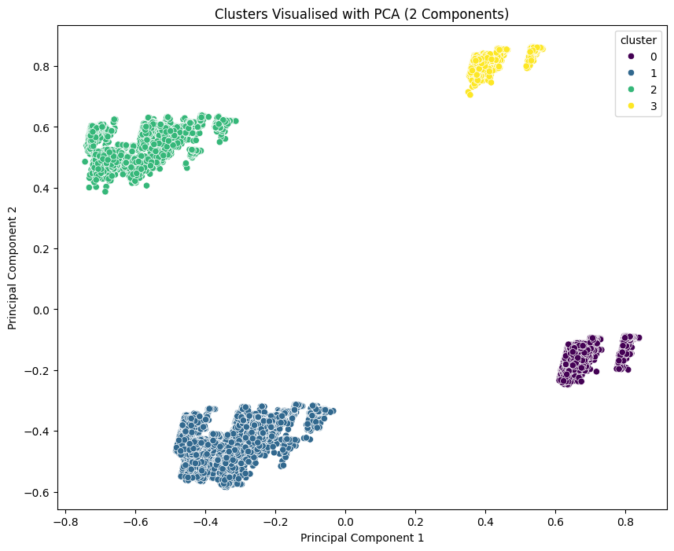
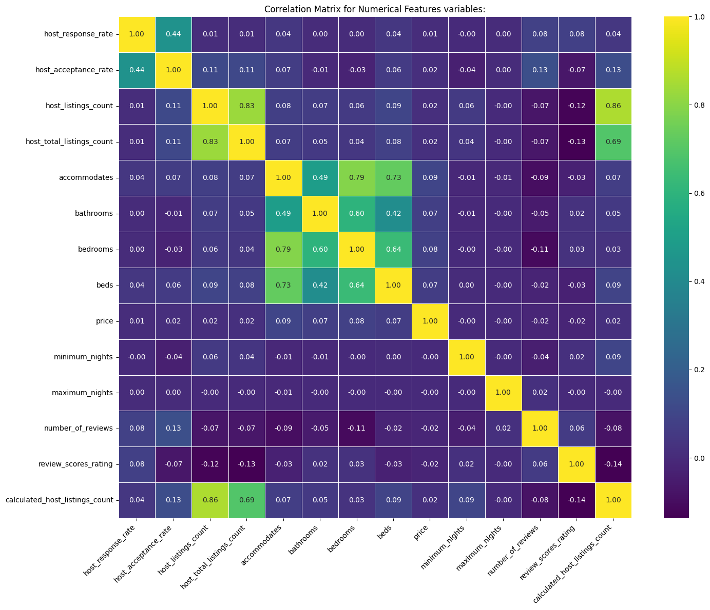
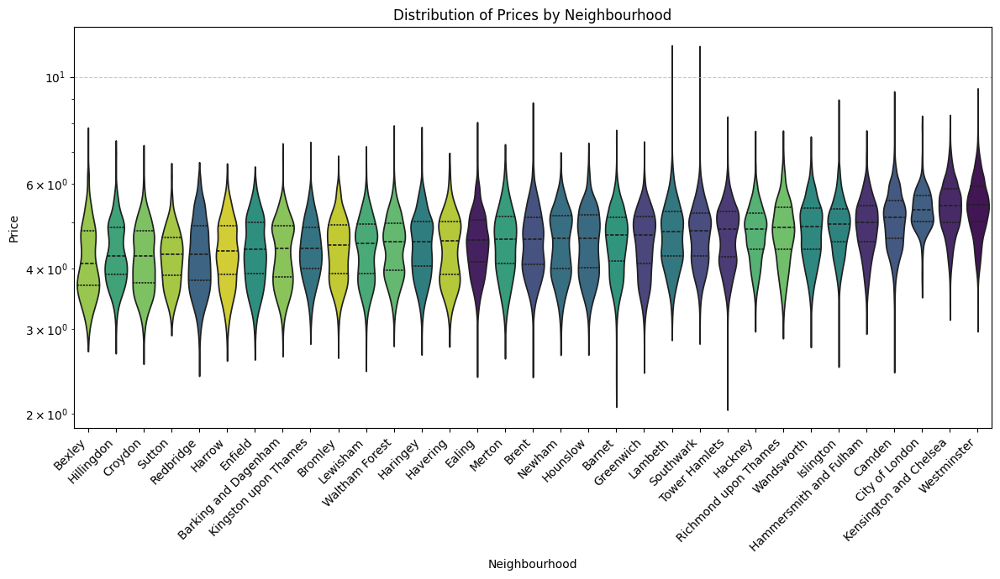
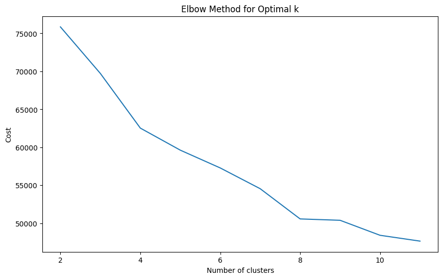
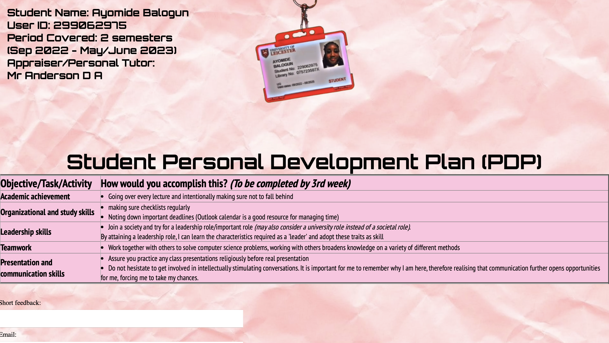

***<h1>Hello, I'm Ayo!👩🏾‍💻✨ </h1>***<h2><li>Junior Software Engineer</li></a> <li>First Class Bsc Computer Science Graduate</li></a> <li>Aspiring FinTech Professional (developer)</li></a> <li>Msc Computational Finance Student at Kings College London (2025-2026)</li></a></h2>

<a href="https://www.linkedin.com/in/ayomide-balogun-346281273/">LinkedIn</a> 

<u><h1>***A little more info...***</h1></u>

Eager to truly immerse myself in the realm of technology, beyond academics, I attained a plethora of experiences that have educated me on many areas within technology. These experiences include... 

- x2 Internships 
  
- Insights, online masterclasses, courses/certificates, experience days, academies, x2 hackathons (Google and Capital-one) and more..

***<h1>💻🕺Here are a few of my Software Development Projects:</h1>***

- <h1><b>Main Projects📌:</b></h1>
    <h2>NextIntern: Personalised Internship Search Platform📌</h2>

  Introducing my final year undergraduate project - NextIntern. NextIntern is a unique location-based web-application helping Technology, Finance and Law students effectively discover, manage and track internship, placement, and graduate opportunities. The application features advanced tools such as machine-learning based match scoring and artificial-intelligence based tailored-feedback. I achieved a first on the dissertation component. 
    
  - Repo: [NextIntern Project Repository (Private)](https://github.com/AyomideBalo/NextIntern_.git)🔒

  - Dissertation: [NextIntern: Personalised Internship Search Platform](https://github.com/AyomideBalo/AyomideBalo/blob/main/reports/229062975DissertationCO3015.docx) (Download raw file to read)
  
    

        
        
        
        
  

  <h2>Airbnb Predictive Pricing Model using Machine Learning (Big Data)📌</h2>
  
  This project involved developing a predictive model to forecast Airbnb property prices in London by leveraging a large dataset of over 65,000 entries and over 31 columns. During this project, I explored key concepts in supervised and unsupervised machine learning, with a specific focus on data manipulation, transformation, and analysis for big data. The project demonstrates my ability to build and evaluate a robust predictive model from a large, raw dataset.
  
  Just a few of the visited areas:
  K-Means clustering, local vs global models, regression, Random Forest, R2 Score and RMSE, Multicollinearity and Overfitting and feature engineering.
  
  Technologies used: Python, Pandas, NumPy, Scikit-learn, Matplotlib, Seaborn
  
  I achieved a final grade of 83% on this project.
      
    - Repo: [Airbnb Predictive Model Project Repository (Public)](https://github.com/AyomideBalo/Airbnb-PredictiveModel/tree/main)
  
    - Report: [Airbnb Predictive Model Report](https://github.com/AyomideBalo/AyomideBalo/blob/main/reports/ab1228ReportBigData.pdf) (Download raw file to read)
  
   

        
        
        
        
  

  <h2>AWS Private Cloud System with a Real-Time Collaborative Whiteboard Application📌</h2>

  This project involved designing and implementing a private cloud system on AWS to host a real-time collaborative whiteboard application. My group and I focused on creating a distributed system that was consistent, scalable, and fault-tolerant.
  
  To ensure all users saw the same whiteboard state, we implemented etcd, which is built on the Raft consensus algorithm. The application was deployed across multiple nodes using Docker containers and automated scripts for seamless deployment and scaling. This project demonstrates my ability to manage cloud resources, handle distributed systems, and implement containerisation.
  
  I achieved a final grade of 71.50% on this project (1:1).
  
    - Repo: [AWS Private Cloud System Report (Private)](https://github.com/AyomideBalo/AWS-Private-Cloud-System) (Download raw file to read)🔒
 
   

        
  

  
- <h1><b>Software & Web Development💻:</b></h1>

<h2>Student Personal Development Plan: Web Page</h2>
    
My first web page. A personal student PDP form using HTML, CSS, and JavaScript. 

A key feature I included was the animated swinging student ID card and landyard to which my lecturer quite liked. 

              
  

        
 - Repo: [Student PDP Project Repository (Private)](https://github.com/AyomideBalo/PersonalProfile-firstyearofuni.git)🔒
    
<h2>Android Shopping-list App & RESTful API for bookstore</h2>
    
For this project, my partner and I designed, implemented, and tested a RESTful API for an online bookstore and developed a full-featured Android shopping list application. We focused on database management and a user-friendly design and achieved a perfect score of 100%.
        
 - Repo: [Android Shopping-list Application & RESTful API for online bookstore (Private)](https://github.com/AyomideBalo/Android-shopping-app.git)🔒

- <h1><b>User Experience🤩:</b></h1>

<h2>High-fidelity & Medium-fidelity prototypes: SneakWise</h2>
      
I developed a high-fidelity prototype for 'SneakWise', a website I designed to serve as a central hub for London's sneaker enthusiasts. This platform allows the community to connect and share their virtual shoe collections. I also developed medium-fidelity wireframes. 

I achieved 84% for the medium fidelity wireframes and 71% for the high-fidelity html prototype.
          
   - Repo: [High-fidelity HTML Prototype (Public)](https://github.com/AyomideBalo/SneakWise.git)
   - Link: https://relaxed-torrone-7cfe7e.netlify.app
   - Report: [High-fidelity HTML Report](https://github.com/AyomideBalo/AyomideBalo/blob/main/reports/ReportCW2.pdf) (Download raw file to read)
   - Wireframes: [Medium-fidelity Prototypes - wireframes](https://github.com/AyomideBalo/AyomideBalo/blob/main/reports/High-fidelity-prototype-UOL.png)

- <h1><b>Requirements Engineering📝:</b></h1>

 <h2>Student Management System</h2>
      
  I designed a student dashboard for a student management system to give students and staff a central hub for academic resources. The main goal was to address the challenges students face in managing their studies by providing a seamless interface to track progress and access key information. 

 I developed a detailed Work Breakdown Structure (WBS) for this project, outlining a variety of features such as a to-do list, a calendar, a grade tracker, and a note-taking platform. I also created a risk register and budget, and defined the roles of the project team members. This project allowed me to learn further about project planning and system requirements.
                
   - Documents: [Student Management System Design Documents](https://github.com/AyomideBalo/AyomideBalo/blob/e8879c179b86cbd399e9aa116817be7abd6b5587/reports/Student%20Management%20System%20-%20toshowTLS.pdf) (Download raw file to read)

<h2>Wash Watcher</h2>
      
My group and I designed 'Wash Watcher', a mobile application designed to improve the laundry experience for university students. The goal was to solve problems with existing systems by providing features that help students save time and avoid crowded laundry rooms. After gathering data on student laundry habits; the insights were able to inform the system's functional and non-functional requirements. This project taught how to use data-driven insights to define and prioritise software requirements.
                
   - Documents: [Wash Watcher Documents](https://github.com/AyomideBalo/AyomideBalo/blob/7f3fdd2fc7ffb52002bf92b96d32eae376da5c54/reports/WashWatcher-Latest.docx) (Download raw file to read)

<h2>Visual Report: Environment, Equality, and AI Bias (Research)</h2>
      
I created a visual report that analyses the impact of technology on the environment, society, and the issue of AI bias. My report explores how technological advancements can influence global carbon emissions, create a digital divide, and perpetuate biases in artificial intelligence. I worked with a partner and completed questions 1 and 3 whilst my partner completed question 2. I achieved 75/100 and 85/100 on my questions.

For Question 1, I critically evaluated the environmental costs and benefits of transistor technology, using data analysis and visualisations to show the correlation between increased transistor usage and CO2 emissions. I achieved a score of 75/100 on this question. For Question 3, I investigated how the global disparity in AI development can introduce biases, using a case study of a clinical risk prediction algorithm to demonstrate how racial bias can be embedded in AI systems. I scored 85/100 on this section. And the lecturer commented on how interesting and well-researched this part section was. 

   - Documents: [Visual Report: Environment, Equality, and AI Bias (Research Documents)](https://github.com/AyomideBalo/AyomideBalo/blob/7f3fdd2fc7ffb52002bf92b96d32eae376da5c54/reports/VisualReportCW.docx)(Download raw file to read)

Please note: I have completed quite a few more projects that may not be on this profile for various reasons 

<!--

- 🔭 I’m currently working on improving my skills regarding the analysis of algorithms
- ⚡ Fun fact about me: Outside of developing, I love fitness, going to the gym and rollerskating
-->
