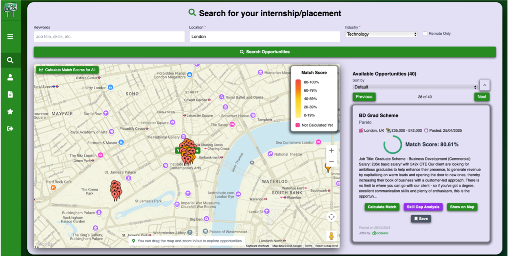

Page under contruction, projects not yet added ‼️
***<h1>Hello, I'm Ayo!👩🏾‍💻✨ </h1>***<h2><li>Junior Software Engineer</li></a> <li>First Class Honours Bsc Computer Science Graduate</li></a> <li>Aspiring FinTech Professional (developer)</li></a> <li>Incoming 2026 Masters Student (Computational Finance KCL Offer and more)</li></a></h2>

<a href="https://www.linkedin.com/in/ayomide-balogun-346281273/">LinkedIn</a> 
<a href="https://frabjous-choux-cfab6e.netlify.app/">Creative Portfolio</a>

<u><h1>***A little more info...***</h1></u>

Eager to truly immerse myself in the realm of technology, beyond academics, I attained a plethora of experiences that have educated me on many areas within technology. These experiences include... 

- x2 Internships 
  
- Insights, online masterclasses, courses/certificates, experience days, academies, x2 hackathons (Google and Capital-one) and more..

***<h1>💻🕺Here are a few of my Software Development Projects:</h1>***

- <h1><b>Main Projects📌:</b></h1>
    <h2>NextIntern: Personalised Internship Search Platform</h2>
    
  - Repo: [Praciting DS & Algos in Python](https://github.com/joshmadakor1/Algorithms-Practice)🔒
  
  - Dissertation: 
  
   

    
    
  

  
  A glimpse of main page welcoming the user.

  User is able to find internship/placement opportunities using the search and filters. Match scoring feature uses predicitive analytics to give a percentage indicating suitability for the opportunity based on users skills, experience and overall profile.

    

        
        
      

  User is able to find internship/placement opportunities using the search and filters. Match scoring feature uses predicitive analytics to give a percentage indicating suitability for the opportunity based on users skills, experience and overall profile.

  Location pins are colour-coded by Match Score.

    

            
          

 
  Platform is able to perform a skill-gap analysis on opportunities to identify gaps and help students to close these skill gaps and attaining opportunities they so desire.
  
- <b>Software and Web Development 💻:</b>
  - [Image Analysis Middleware](https://github.com/joshmadakor1/4chan-Image-Analysis-Middleware-C964) <b>(Potentially NSFW)</b>
- <b>User Experience🎨:</b>
  - [Image Analysis Middleware](https://github.com/joshmadakor1/4chan-Image-Analysis-Middleware-C964) <b><i>(Potentially NSFW)</b></i>
- <b>Requirements Engineering📝:</b>
  - [Image Analysis Middleware](https://github.com/joshmadakor1/4chan-Image-Analysis-Middleware-C964) <b><i>(Potentially NSFW)</b></i>
- <b>Databases and Domain Modelling🗄️:</b>
  - [Image Analysis Middleware](https://github.com/joshmadakor1/4chan-Image-Analysis-Middleware-C964) <b><i>(Potentially NSFW)</b></i>
- <b>Research🔬:</b>
  - [Image Analysis Middleware](https://github.com/joshmadakor1/4chan-Image-Analysis-Middleware-C964) <b><i>(Potentially NSFW)</b></i>
  
<!--

- 🔭 I’m currently working on improving my skills regarding the analysis of algorithms
- ⚡ Fun fact about me: Outside of developing, I love fitness, going to the gym and rollerskating
-->
