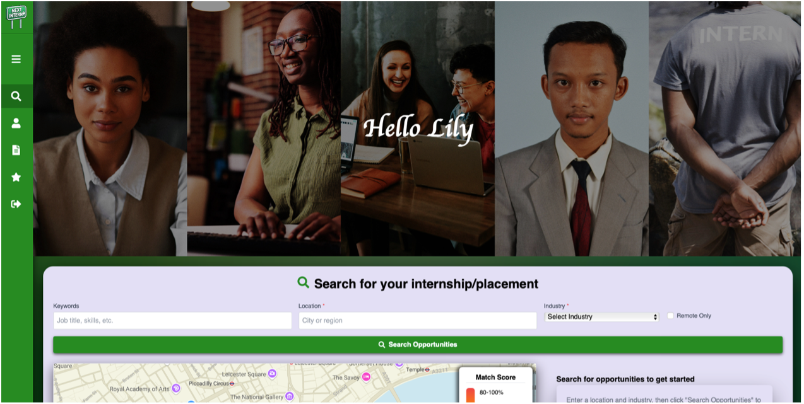
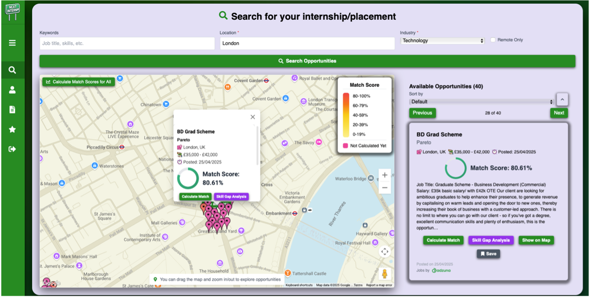
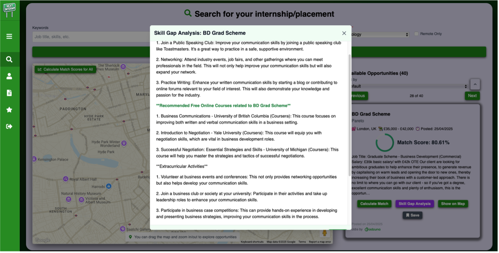
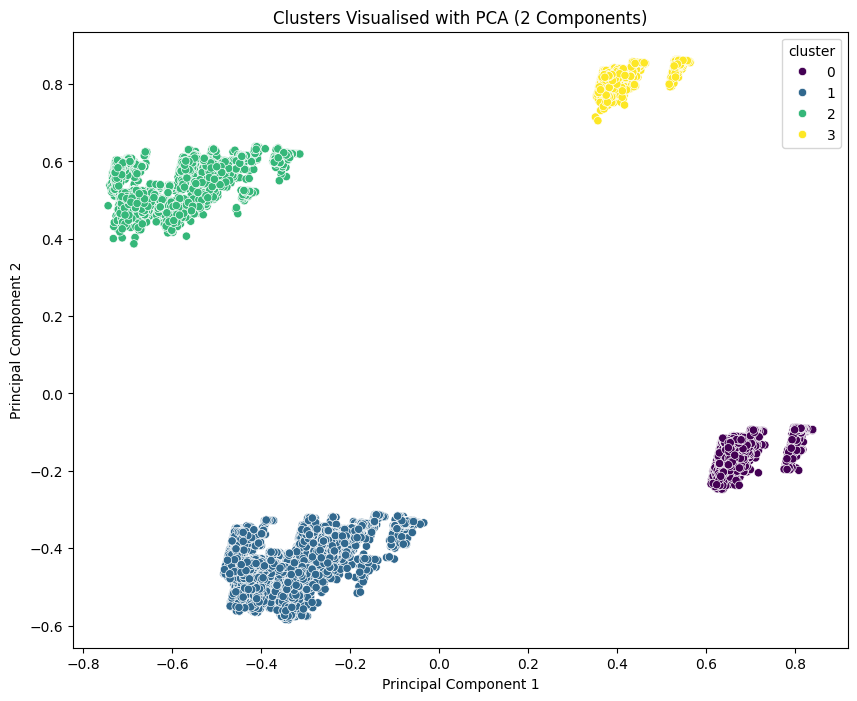
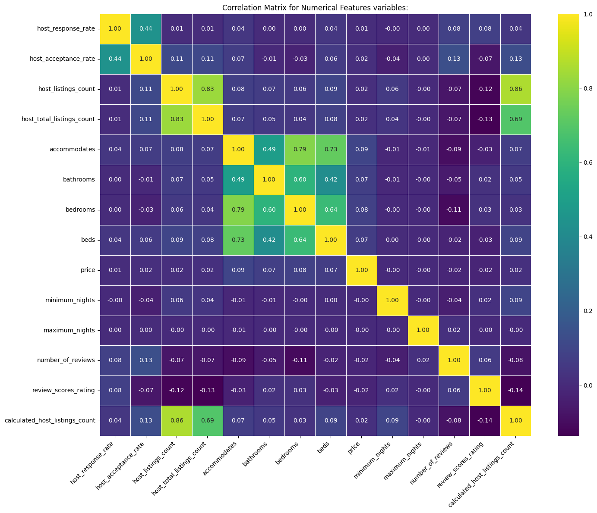
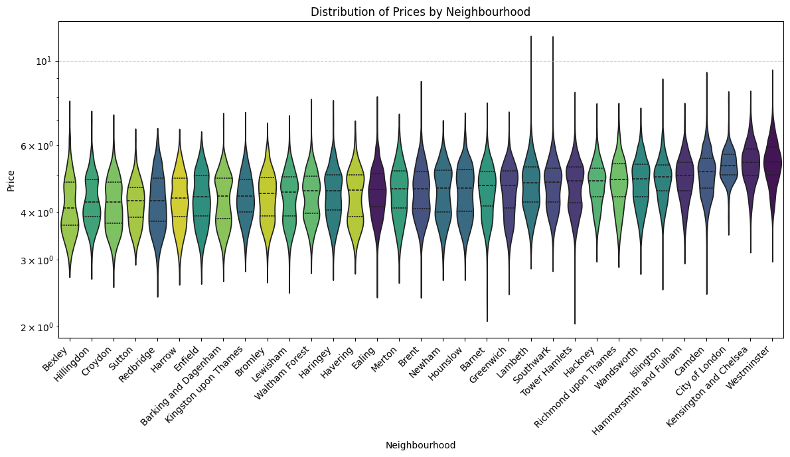
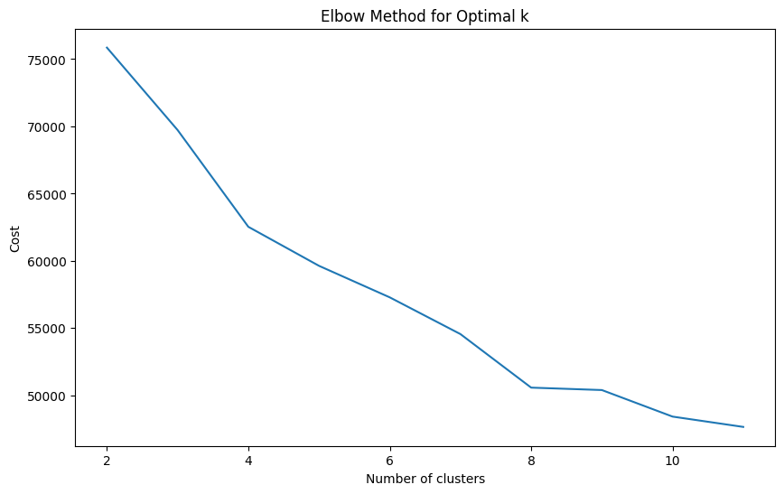
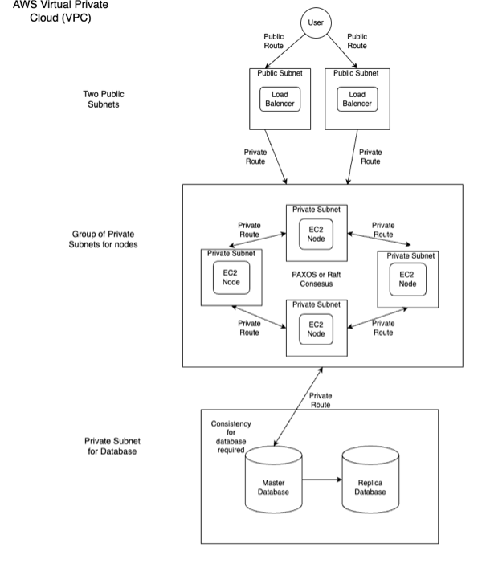

under construction

***<h1>Hello, I'm Ayo!👩🏾‍💻✨ </h1>***<h2><li>Junior Software Engineer</li></a> <li>First Class Bsc Computer Science Graduate</li></a> <li>Aspiring FinTech Professional (developer)</li></a> <li>Msc Computational Finance Student at Kings College London (2025-2026)</li></a></h2>

<a href="https://www.linkedin.com/in/ayomide-balogun-346281273/">LinkedIn</a> 
<a href="">Creative Portfolio (under-construction)</a>

<u><h1>***A little more info...***</h1></u>

Eager to truly immerse myself in the realm of technology, beyond academics, I attained a plethora of experiences that have educated me on many areas within technology. These experiences include... 

- x2 Internships 
  
- Insights, online masterclasses, courses/certificates, experience days, academies, x2 hackathons (Google and Capital-one) and more..

***<h1>💻🕺Here are a few of my Software Development Projects:</h1>***

- <h1><b>Main Projects📌:</b></h1>
    <h2>NextIntern: Personalised Internship Search Platform📌</h2>

  Introducing my final year undergraduate project - NextIntern. NextIntern is a unique location-based web-application helping Technology, Finance and Law students effectively discover, manage and track internship, placement, and graduate opportunities. The application features advanced tools such as machine-learning based match scoring and artificial-intelligence based tailored-feedback. I achieved a first on the dissertation component. 
    
  - Repo: [NextIntern Project Repository (Private)](https://github.com/AyomideBalo/NextIntern_.git)🔒

  - Dissertation: [NextIntern: Personalised Internship Search Platform](https://github.com/AyomideBalo/AyomideBalo/blob/main/229062975DissertationCO3015.docx) (Download raw file to read)
  
    

        
        
        
        
  

  <h2>Airbnb Predictive Pricing Model using Machine Learning (Big Data)📌</h2>
  
  This project involved developing a predictive model to forecast Airbnb property prices in London by leveraging a large dataset of over 65,000 entries and over 31 columns. During this project, I explored key concepts in supervised and unsupervised machine learning, with a specific focus on data manipulation, transformation, and analysis for big data. The project demonstrates my ability to build and evaluate a robust predictive model from a large, raw dataset.
  
  Just a few of the visited areas:
  K-Means clustering, local vs global models, regression, Random Forest, R2 Score and RMSE, Multicollinearity and Overfitting and feature engineering.
  
  Technologies used: Python, Pandas, NumPy, Scikit-learn, Matplotlib, Seaborn
  
  I achieved a final grade of 83% on this project.
      
    - Repo: [Airbnb Predictive Model Project Repository (Public)](https://github.com/AyomideBalo/Airbnb-PredictiveModel/tree/main)🔓
  
    - Report: [Airbnb Predictive Model Report](https://github.com/AyomideBalo/AyomideBalo/blob/main/ab1228ReportBigData.pdf) (Download raw file to read)
  
   

        
        
        
        
  

  <h2>AWS Private Cloud System with a Real-Time Collaborative Whiteboard Application📌</h2>

  This project involved designing and implementing a private cloud system on AWS to host a real-time collaborative whiteboard application. My group and I focused on creating a distributed system that was consistent, scalable, and fault-tolerant.
  
  To ensure all users saw the same whiteboard state, we implemented etcd, which is built on the Raft consensus algorithm. The application was deployed across multiple nodes using Docker containers and automated scripts for seamless deployment and scaling. This project demonstrates my ability to manage cloud resources, handle distributed systems, and implement containerisation.
  
  I achieved a final grade of 71.50% on this project (1:1).
  
    - Repo: [AWS Private Cloud System Report (Private)](https://github.com/AyomideBalo/AWS-Private-Cloud-System) (Download raw file to read)🔒
 
   

        
  

<!--

- 🔭 I’m currently working on improving my skills regarding the analysis of algorithms
- ⚡ Fun fact about me: Outside of developing, I love fitness, going to the gym and rollerskating
-->
